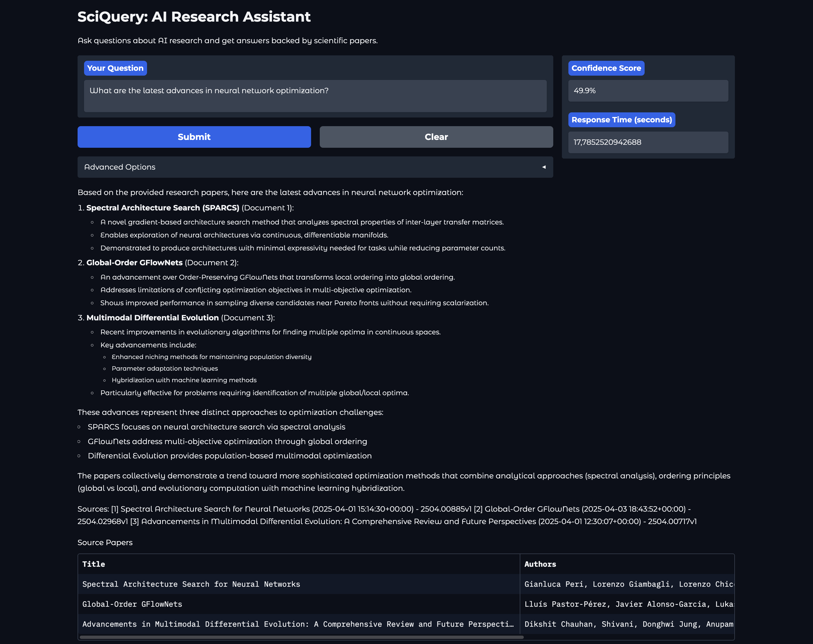

# SciQuery LLM



## Overview

SciQuery is an advanced research assistant that answers complex scientific questions by reasoning over research papers. The system uses Retrieval-Augmented Generation (RAG) to find relevant papers from arXiv and provide accurate, well-cited answers to AI research questions.

## Features

- **Scientific Research Assistant**: Get detailed answers to questions about AI research with citations to source papers
- **RAG Pipeline**: Uses a state-of-the-art RAG approach with FAISS vector database for efficient retrieval
- **Confidence Scoring**: Provides confidence scores for each answer based on the relevance of retrieved documents
- **Web Interface**: Modern, user-friendly interface with advanced query options
- **Citation Support**: Automatically includes citations to source papers

## Technical Details

SciQuery combines several key technologies:

- **Embedding Model**: Sentence-BERT for converting text to vector embeddings
- **Vector Database**: FAISS for efficient similarity search
- **Large Language Model**: Uses the Hugging Face API with DeepSeek model for answer generation
- **Data Pipeline**: Collects and processes papers from arXiv's AI category
- **Web Interface**: Built with Gradio for an intuitive user experience

## Installation

1. Clone the repository:
   ```
   git clone https://github.com/yourusername/SciQuery-LLM.git
   cd SciQuery-LLM
   ```

2. Install the required packages:
   ```
   pip install -r requirements.txt
   ```
https://huggingface.co/docs/inference-providers/en/index#authentication
3. Set up your environment variables:
   - Create a `.env` file with your HuggingFace API token:
     ```
     HF_TOKEN=your_huggingface_token
     ```

## Data Collection

To collect papers from arXiv:

```
python collect_data.py --categories cs.AI --max_results 500 --output_dir data
```

Options:
- `--categories`: arXiv categories to collect papers from (default: cs.AI)
- `--max_results`: Maximum number of papers to collect per category (default: 500)
- `--output_dir`: Directory to save the collected data (default: data)

## Building the Index

After collecting data, you need to create a FAISS index for efficient retrieval:

```
python scripts/create_index.py --data_path data/arxiv_papers_cs.AI.csv --index_path data/sciquery_index.faiss
```

## Running the Application

Launch the web interface:

```
python app.py
```

The application will be available at http://localhost:7860.

## Usage

1. Enter your scientific question in the text input field
2. Adjust advanced options if desired:
   - Number of papers to retrieve
   - Similarity threshold
   - Citation preferences
3. Submit your query
4. Review the answer along with confidence score and source papers

## Project Structure

- `collect_data.py`: Script for collecting papers from arXiv
- `rag_pipeline.py`: Core RAG implementation with retrieval and generation
- `app.py`: Web interface using Gradio
- `data/`: Directory containing collected papers and FAISS index
- `requirements.txt`: Required Python packages
